# 🗺️ Information Architecture — Konveksio

> **Versi:** 1.0
> **Tanggal:** 5 Juni 2026
> **Reference:** requirement_spec.md, user_flows.md

---

## 1. Arsitektur Navigasi Global

### 1.1 Bottom Navigation (Tab Utama)

```
┌─────────────────────────────────────────────────────┐
│                    KONVEKSIO APP                     │
├──────────┬──────────┬───────────┬───────────────────┤
│ 🏠       │ 📋       │ ⚙️        │ 👤                │
│ Beranda  │ Order    │ Produksi  │ Profil            │
└──────────┴──────────┴───────────┴───────────────────┘
                              │
                         [FAB ＋]
                    (Floating Action Button)
```

### 1.2 FAB Menu (Aksi Cepat)

Saat FAB ditekan, muncul menu expandable:

| Role | Opsi FAB |
|---|---|
| Super Admin / Admin | + Order Baru, + Input Pembayaran |
| Staff Produksi | + Handover Estafet, + Ajukan Kasbon |

---

## 2. Sitemap Detail Per Tab

### 2.1 Tab: Beranda (Dashboard)

```
🏠 Beranda
│
├── Greeting Header
│   ├── "Selamat [Pagi/Siang/Sore], [Nama]"
│   └── Role & Cabang aktif
│
├── Quick Stats Cards (horizontal scroll)
│   ├── Total Order Aktif
│   ├── Pendapatan Bulan Ini
│   ├── Order Selesai Bulan Ini
│   └── Gaji Borongan Periode Ini (Staff only)
│
├── Order Perlu Perhatian (card list)
│   ├── Deadline Mendekat (H-3, H-1)
│   └── Deadline Terlewat
│
├── Grafik Pendapatan & Pengeluaran (bar chart, 6 bulan terakhir)
│
├── Order per Status (donut chart)
│   └── Pending | DP | Produksi | Siap Kirim | Selesai
│
├── Top 5 Pelanggan (list)
│
├── Performa Produksi
│   └── Rata-rata waktu penyelesaian order (line chart)
│
└── Filter Cabang (Super Admin only)
    └── [Semua] [Serang] [Solo]
```

**Catatan Conditional per Role:**

| Komponen | Super Admin | Admin Cabang | Staff Produksi |
|---|---|---|---|
| Quick Stats | Semua cabang | Cabang sendiri | Gaji sendiri saja |
| Order Perlu Perhatian | ✅ | ✅ | ❌ |
| Grafik Keuangan | ✅ | ✅ | ❌ |
| Filter Cabang | ✅ | ❌ | ❌ |
| Top Pelanggan | ✅ | ✅ | ❌ |

---

### 2.2 Tab: Order

```
📋 Order
│
├── Search Bar (cari by nama pelanggan, nomor order)
│
├── Filter Chips (horizontal scroll)
│   ├── [Semua]
│   ├── [Pending]
│   ├── [DP Diterima]
│   ├── [Diproduksi]
│   ├── [QC & Packing]
│   ├── [Siap Kirim]
│   ├── [Dikirim]
│   └── [Selesai]
│
├── Sort: [Terbaru] [Deadline Terdekat] [Nominal Terbesar]
│
├── Order List (infinite scroll)
│   └── Order Card:
│       ├── Status Badge
│       ├── No. Order: #ORD-202606-0001
│       ├── Pelanggan: PT ABC
│       ├── Produk: Kaos Polo × 200pcs
│       ├── Deadline: 15 Jun 2026
│       ├── Total: Rp 15.000.000
│       └── Progress Bar: 65%
│
└── [Tap Order Card] → Detail Order
    │
    ├── Tab: Info Order
    │   ├── Data pelanggan (nama, instansi/organisasi (jika ada), WA, alamat)
    │   ├── List item pesanan
    │   │   └── Per item: produk, qty per size, bahan, warna, harga, SPK
    │   ├── File desain (preview gambar/PDF)
    │   ├── Catatan khusus
    │   ├── Deadline & metode pengiriman
    │   ├── Cabang produksi
    │   └── [Edit Order] [Hapus Order] [Persiapan Produksi]
    │
    ├── Tab: Produksi (Kanban View)
    │   ├── Kanban Board (Pending, Potong, Jahit, Sablon, dll)
    │   ├── Card Per Item Pesanan (SPK) di Kanban
    │   ├── Visual progress per tahap (lihat DS: Progress Bar)
    │   │   └── Per tahap: nama, qty selesai/total, karyawan yang mengerjakan (keroyokan)
    │   ├── Timeline log handover
    │   │   └── "[Budi] handover 30pcs L dari Potong ke Jahit — 05 Jun 14:30"
    │   └── [Konfigurasi Tahap & Tarif] (Admin only)
    │
    ├── Tab: Pembayaran
    │   ├── Ringkasan: Total | Terbayar | Sisa
    │   ├── Riwayat pembayaran (list kronologis)
    │   │   └── Per item: jenis (DP/Cicilan/Pelunasan), nominal, tanggal, metode, bukti
    │   ├── Status: Lunas / Belum Lunas / Sebagian
    │   ├── [+ Input Pembayaran]
    │   └── [Kirim Invoice via WA]
    │
    ├── Tab: Invoice & SPK
    │   ├── Preview invoice (in-app)
    │   ├── Daftar SPK per Order Item
    │   ├── [Download PDF (Invoice/SPK)]
    │   ├── [Share Public Link]
    │   └── [Tampilkan QR Code]
    │
    └── Tab: Pengiriman
        ├── Metode pengiriman
        ├── Data pengiriman (resi, driver, dll.)
        └── [Proses Pengiriman] / [Konfirmasi Selesai]
```

---

### 2.3 Tab: Produksi

#### Untuk Admin / Super Admin:
```
⚙️ Produksi
│
├── Filter Cabang: [Serang] [Solo] (Super Admin only)
│
├── Ringkasan Produksi (cards)
│   ├── Order Dalam Produksi: [X]
│   ├── Total Pcs Dalam Proses: [X]
│   └── Rata-rata Progress: [X]%
│
├── Papan Kanban (Kanban Board)
│   ├── Kolom berdasarkan tahapan (Potong, Sablon, Jahit, dll)
│   └── Card berisi SPK/Order Item
│       ├── Nama pelanggan & produk
│       ├── Progress bar per tahap (mini visual)
│       └── Deadline
│
├── [Tap Card/SPK] → Detail Produksi (sama seperti tab Produksi di Detail Order)
│
└── [Bagi Porsi/Keroyokan]
    ├── Tukang Potong / Boss membagi qty ke karyawan (misal: A=30, B=70)
```

#### Untuk Staff Produksi:
```
⚙️ Tugas Saya
│
├── Greeting: "Halo [Nama], ada [X] tugas menunggu"
│
├── Tab: [Menunggu] [Dalam Proses] [Selesai]
│
├── Menunggu (incoming handover)
│   └── Card:
│       ├── "100pcs Kaos Polo masuk ke proses JAHIT"
│       ├── Dari: Budi (Potong)
│       ├── Order #123
│       └── [Terima & Mulai Kerjakan]
│
├── Dalam Proses
│   └── Card:
│       ├── Order #123 - Kaos Polo
│       ├── Tahap: JAHIT
│       ├── Progress: 60/100 pcs
│       ├── [Update Progress] → Input qty yang sudah selesai
│       └── [Handover ke Proses Berikutnya]
│           ├── Input qty handover
│           ├── Pilih proses tujuan
│           ├── Catatan [opsional]
│           └── [Konfirmasi]
│
└── Selesai
    └── Riwayat tugas yang sudah di-handover (bulan ini)
```

---

### 2.4 Tab: Profil

```
👤 Profilku
│
├── Header Profil (Gojek Style)
│   ├── Avatar (inisial nama)
│   ├── Nama lengkap
│   ├── Email
│   ├── No HP
│   └── [Edit Profil] (Ikon Pensil)
│
├── Preferensi
│   ├── Keamanan Akun
│   │   ├── Ubah PIN / Password
│   │   └── Setup biometrik (Fingerprint/FaceID)
│   └── Pengaturan Aplikasi
│       ├── Notifikasi (Push & WhatsApp)
│       └── Tentang Aplikasi (Versi & Kebijakan)
│
├── Aktivitas di Konveksio
│   ├── Slip Gaji Saya (Staff only)
│   ├── Kasbon Saya (Staff: Ajukan & Riwayat)
│   └── Riwayat Handover (Staff: Log estafet)
│
├── Pengaturan Perusahaan (Admin+ only) → [Membuka Halaman Pengaturan]
│
└── 🔓 Logout (Konfirmasi dialog)
```

### 2.5 Halaman Pengaturan Perusahaan (Admin+ only)

```
⚙️ Pengaturan Perusahaan
│
├── Manajemen Operasional
│   ├── 👷 Karyawan
│   │   ├── Daftar karyawan (per cabang)
│   │   ├── [+ Tambah Karyawan]
│   │   └── Detail & Rekap Gaji Karyawan
│   ├── 👥 Pelanggan
│   │   ├── Daftar pelanggan & pencarian
│   │   └── [+ Tambah Pelanggan]
│   └── 🏭 Vendor
│       ├── Daftar vendor & kategori
│       └── [+ Tambah Vendor]
│
├── Keuangan & Tarif
│   ├── 📊 Laporan Keuangan
│   │   ├── Laporan Pendapatan, Pengeluaran & Profit
│   │   └── [Export PDF / Excel]
│   ├── 🔄 Transaksi Antar Cabang
│   │   ├── Log mutasi antar cabang
│   │   └── [+ Buat Transaksi]
│   ├── 🏷️ Katalog Produk & Bundle
│   │   ├── Daftar produk & tarif per tahap
│   │   └── Setup Produk Bundle (misal: Seragam Pramuka)
│   └── 💰 Rekap Gaji Borongan
│       └── Rekapitulasi gaji & Kasbon seluruh karyawan
│
└── Konfigurasi Sistem
    ├── 🏛️ Pengaturan Cabang (Super Admin only)
    │   ├── Daftar cabang
    │   ├── [+ Tambah Cabang]
    │   └── Detail Cabang (Atur Alamat, Kontak Telepon, Email, Info Invoice spesifik per cabang)
    ├── 🧾 Pengaturan Rekening
    │   └── Rekening pembayaran per cabang
    └── 👥 Kelola User & Role (Super Admin only)
```
```

---

## 3. Peta Halaman (Screen List)

### 3.1 Daftar Seluruh Screen

| ID | Screen | Parent | Role Access |
|---|---|---|---|
| S-01 | Splash Screen | — | All |
| S-02 | Login | — | All |
| S-03 | Setup Biometrik | Login | All |
| S-04 | Dashboard (Beranda) | Tab 1 | All (conditional content) |
| S-05 | Daftar Order | Tab 2 | Admin+ |
| S-06 | Detail Order | Daftar Order | Admin+ |
| S-07 | Form Order Baru | FAB | Admin+ |
| S-08 | Form Edit Order | Detail Order | Admin+ |
| S-09 | Form Input Pembayaran | Detail Order | Admin+ |
| S-10 | Preview Invoice | Detail Order | Admin+ |
| S-11 | Form Pengiriman | Detail Order | Admin+ |
| S-12 | Produksi Overview | Tab 3 (Admin) | Admin+ |
| S-13 | Tugas Saya | Tab 3 (Staff) | Staff |
| S-14 | Form Handover | Tugas Saya | Staff |
| S-15 | Profil | Tab 4 | All |
| S-16 | Daftar Pelanggan | Profil | Admin+ |
| S-17 | Detail Pelanggan | Daftar Pelanggan | Admin+ |
| S-18 | Form Pelanggan | Daftar Pelanggan | Admin+ |
| S-19 | Daftar Vendor | Profil | Admin+ |
| S-20 | Detail Vendor | Daftar Vendor | Admin+ |
| S-21 | Form Vendor | Daftar Vendor | Admin+ |
| S-22 | Daftar Karyawan | Profil | Admin+ |
| S-23 | Detail Karyawan | Daftar Karyawan | Admin+ |
| S-24 | Form Karyawan | Daftar Karyawan | Admin+ |
| S-25 | Rekap Gaji | Profil | Admin+ |
| S-26 | Detail Gaji Karyawan | Rekap Gaji | Admin+ |
| S-27 | Kasbon - Staff View | Profil | Staff |
| S-28 | Kasbon - Admin View | Profil | Admin+ |
| S-29 | Form Ajukan Kasbon | Kasbon | Staff |
| S-30 | Laporan Keuangan | Profil | Admin+ |
| S-31 | Transaksi Antar Cabang | Profil | Admin+ |
| S-32 | Form Transaksi Cabang | Transaksi Antar Cabang | Admin+ |
| S-33 | Katalog Produk | Profil | Admin+ |
| S-34 | Form Produk & Tarif | Katalog Produk | Super Admin |
| S-35 | Pengaturan | Profil | All |
| S-36 | Edit Profil | Pengaturan | All |
| S-37 | Pengaturan Cabang | Pengaturan | Super Admin |
| S-38 | Pengaturan Invoice | Pengaturan | Admin+ |
| S-39 | Kelola User & Role | Pengaturan | Super Admin |
| S-40 | Notifikasi (List) | Header bell icon | All |
| S-41 | Public Link Invoice | External (Laravel blade view) | Pelanggan (tanpa login) |
| S-42 | Konfigurasi Tahap Produksi | Detail Order | Admin+ |
| S-43 | Slip Gaji Saya | Profil (Staff) | Staff |
| S-44 | Rekap Gaji Bulanan | Profil (Staff) / Rekap Gaji (Admin) | All |

### 3.2 Total Screen Count
- **Total:** 44 screens
- **Admin-facing:** 36 screens
- **Staff-facing:** 17 screens (subset, termasuk Slip Gaji & Rekap Bulanan)
- **External (public):** 1 screen (Laravel blade view, bukan Flutter)

---

## 4. Navigasi Antar Screen (Flow Diagram)

```mermaid
graph TD
    SPLASH[S-01 Splash] --> LOGIN[S-02 Login]
    LOGIN --> BIO[S-03 Setup Biometrik]
    LOGIN --> DASH[S-04 Dashboard]
    BIO --> DASH

    subgraph "Bottom Navigation"
        DASH
        ORDER_LIST[S-05 Daftar Order]
        PROD[S-12/S-13 Produksi]
        PROFILE[S-15 Profil]
    end

    DASH --> NOTIF[S-40 Notifikasi]
    
    ORDER_LIST --> ORDER_DETAIL[S-06 Detail Order]
    ORDER_DETAIL --> EDIT_ORDER[S-08 Edit Order]
    ORDER_DETAIL --> INPUT_PAY[S-09 Input Pembayaran]
    ORDER_DETAIL --> INVOICE[S-10 Preview Invoice]
    ORDER_DETAIL --> SHIPPING[S-11 Pengiriman]
    ORDER_DETAIL --> CONFIG_STAGE[S-42 Konfigurasi Tahap]
    
    PROD --> |Staff| HANDOVER[S-14 Handover]
    
    PROFILE --> CUSTOMER[S-16 Pelanggan]
    PROFILE --> VENDOR[S-19 Vendor]
    PROFILE --> EMPLOYEE[S-22 Karyawan]
    PROFILE --> SALARY[S-25 Rekap Gaji]
    PROFILE --> KASBON_ADMIN[S-28 Kasbon Admin]
    PROFILE --> KASBON_STAFF[S-27 Kasbon Staff]
    PROFILE --> FINANCE[S-30 Laporan Keuangan]
    PROFILE --> INTER_BRANCH[S-31 Transaksi Cabang]
    PROFILE --> CATALOG[S-33 Katalog Produk]
    PROFILE --> SETTINGS[S-35 Pengaturan]

    CUSTOMER --> CUST_DETAIL[S-17 Detail Pelanggan]
    VENDOR --> VEND_DETAIL[S-20 Detail Vendor]
    EMPLOYEE --> EMP_DETAIL[S-23 Detail Karyawan]
    SALARY --> SALARY_DETAIL[S-26 Detail Gaji]
    KASBON_STAFF --> KASBON_FORM[S-29 Form Kasbon]
    
    SETTINGS --> EDIT_PROFILE[S-36 Edit Profil]
    SETTINGS --> BRANCH_SET[S-37 Pengaturan Cabang]
    SETTINGS --> INV_SET[S-38 Pengaturan Invoice]
    SETTINGS --> USER_MGMT[S-39 Kelola User]
```



---

## 5. Data Model Overview

### 5.1 Entity Relationship (Simplified)

```
┌─────────────┐     ┌──────────────┐     ┌──────────────────┐
│   CABANG    │────<│   KARYAWAN   │────<│ LOG HANDOVER     │
│             │     │ (User App)   │     │ (who, qty, when) │
└──────┬──────┘     └──────┬───────┘     └────────┬─────────┘
       │                   │                      │
       │            ┌──────┴───────┐              │
       │            │    KASBON    │              │
       │            └──────────────┘              │
       │                                          │
┌──────┴──────┐     ┌──────────────┐     ┌────────┴─────────┐
│    ORDER    │────<│ ORDER ITEM   │────<│ TAHAP PRODUKSI   │
│             │     │ (SPK/Bundle) │     │ (Matriks Tarif)  │
└──────┬──────┘     └──────────────┘     └──────────────────┘
       │
       │            ┌──────────────┐
       ├───────────<│  PEMBAYARAN  │
       │            │ (DP,cicilan) │
       │            └──────────────┘
       │
       │            ┌──────────────┐
       ├───────────<│  PENGIRIMAN  │
       │            └──────────────┘
       │
┌──────┴──────┐
│  PELANGGAN  │
└─────────────┘

┌─────────────┐     ┌──────────────┐
│   VENDOR    │────<│ TRX VENDOR   │
└─────────────┘     └──────────────┘

┌─────────────┐     ┌──────────────┐
│ PRODUK/BNDL │────<│ TARIF        │
│  (Katalog)  │     │ (per tahap)  │
└─────────────┘     └──────────────┘

┌──────────────────────────┐
│  TRANSAKSI ANTAR CABANG  │
│ (cabang_asal, tujuan)    │
└──────────────────────────┘
```

### 5.2 Entitas Utama & Field Summary

> ⚠️ **Isolasi Cabang:** Semua entitas data terikat ke cabang. Lihat `docs/standard/SECURITY_PRIVACY_STANDARD.md` untuk kebijakan lengkap.

| Entitas | Field Kunci |
|---|---|
| **Cabang** | id, nama, alamat, telepon, email_cabang, info_invoice, periode_gajian, hari_gajian |
| **Karyawan** | id, nama, email, pin, no_whatsapp, kontak, posisi, **cabang_id**, role, status_aktif |
| **Pelanggan** | id, **cabang_id**, nama, instansi, whatsapp, telepon, email, alamat |
| **Vendor** | id, **cabang_id**, nama, kontak, alamat, kategori[], tarif_layanan[] |
| **Produk** | id, **cabang_id**, nama, kategori, tipe(single/bundle), komponen_bundle[], tarif_produksi[] |
| **Order** | id, nomor_order, pelanggan_id, **cabang_id**, status (termasuk CANCELLED), tanggal_dibuat, deadline, metode_kirim, total_harga, catatan |
| **Order Item (SPK)** | id, order_id, produk_id, parent_bundle_id, no_spk, qty_s, qty_m, qty_l, qty_xl, qty_custom, bahan, warna, harga_satuan, desain_file, status |
| **Tahap Produksi** | id, order_item_id, nama_tahap, urutan, qty_target, qty_selesai, qty_reject, status, tarif_aktual, vendor_id |
| **Porsi Pekerjaan** | id, tahap_produksi_id, karyawan_id, qty_assigned |
| **Log Handover** | id, tahap_dari_id, tahap_ke_id, karyawan_id, qty_per_size{}, qty_reject, is_paid_rework, catatan, timestamp |
| **Pembayaran** | id, order_id, jenis(DP/cicilan/pelunasan), jumlah, tanggal, metode, file_kuitansi, catatan |
| **Invoice** | id, order_id, nomor_invoice, public_link_code, qr_code, tanda_tangan, status |
| **Kasbon** | id, karyawan_id, jumlah, keperluan, status(pending/approved/rejected), approved_by, tanggal |
| **Pengeluaran** | id, **cabang_id**, kategori, jumlah, tanggal, deskripsi, vendor_id (opsional) |
| **Pengiriman** | id, order_id, metode, nama_ekspedisi, nomor_resi, ongkir, tanggal_kirim, penerima |
| **Transaksi Antar Cabang** | id, cabang_asal_id, cabang_tujuan_id, jenis, items[], total, tanggal |
| **Notifikasi** | id, user_id, jenis, judul, pesan, is_read, data_ref, timestamp |
| **Rekening** | id, **cabang_id**, nama_bank, nomor_rekening, atas_nama, is_active |
| **Gaji** | id, karyawan_id, periode_mulai, periode_selesai, total_pcs, gaji_kotor, total_kasbon, potongan_lain, gaji_bersih, status |


---

## 6. Notifikasi Architecture

### 6.1 Push Notification (FCM)

| Trigger | Penerima | Pesan |
|---|---|---|
| Handover estafet | Staff di proses tujuan | "Ada [X]pcs [produk] masuk ke proses [tahap] Anda" |
| Deadline H-3 | Admin Cabang | "⚠️ Order #[id] deadline 3 hari lagi" |
| Deadline H-1 | Admin Cabang + Super Admin | "🚨 Order #[id] deadline BESOK!" |
| Kasbon diajukan | Boss Cabang / Super Admin | "Kasbon Rp[X] diajukan oleh [Nama]" |
| Kasbon di-approve | Karyawan pengaju | "Kasbon Rp[X] Anda telah disetujui ✅" |
| Kasbon ditolak | Karyawan pengaju | "Kasbon Rp[X] Anda ditolak ❌" |

### 6.2 WhatsApp Notification (via API)

| Trigger | Penerima | Template Pesan |
|---|---|---|
| Order baru + Invoice | Pelanggan | "Halo [Nama], pesanan Anda telah kami terima. No. Order: [nomor]. Cek detail & invoice: [public_link]" |
| Pembayaran diterima | Pelanggan | "Pembayaran [jenis] sebesar Rp[X] telah kami terima. Sisa: Rp[Y]. Detail: [public_link]" |
| Status → Diproduksi | Pelanggan | "Pesanan Anda sedang dalam proses produksi. Cek progress: [public_link]" |
| Status → Siap Kirim | Pelanggan | "Pesanan Anda sudah siap kirim! Detail: [public_link]" |
| Status → Dikirim | Pelanggan | "Pesanan Anda telah dikirim via [metode]. Resi: [resi]. Cek: [public_link]" |

---

## 7. Offline Architecture

### 7.1 Data yang Tersedia Offline

| Data | Staff Produksi | Admin |
|---|---|---|
| Daftar tugas produksi saya | ✅ (full sync) | — |
| Detail order yang ditugaskan | ✅ (read-only) | — |
| Update progress (qty) | ✅ (queue, sync later) | — |
| Handover | ✅ (queue, sync later) | — |
| Daftar order | — | ✅ (last sync) |
| Input pembayaran | — | ❌ (online only) |

### 7.2 Sync Strategy
- **Sync interval:** Setiap kali app dibuka + pull-to-refresh manual
- **Conflict resolution:** Additive Sync (penjumlahan data qty untuk progress) guna mencegah bentrok *race condition*, bukan *last-write-wins*
- **Queue:** Aksi offline (handover, update progress) masuk ke queue lokal, di-sync saat online
- **Indicator:** Tampilkan badge "Offline" di app bar saat tidak ada koneksi

---
